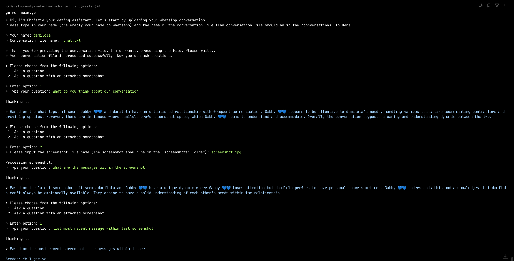

### Contextual Chatbot

This is a chatbot that uses contextual information from your Whatsapp messages and screenshots to answer questions.

#### Features
- Screenshot uploads and analysis
- Contextual analysis

It use **[Anthropic's Claude 3 Haiku](https://www.anthropic.com/news/claude-3-haiku)**

### Usage
- Upload screenshots to  the `screenshots` folder
- Upload Whatsapp conversations to the `conversations` folder
- `go run main.go`
- Add your Anthropic API key to the `.env` file

### Test
`go test -v ./...`

### Screenshots
